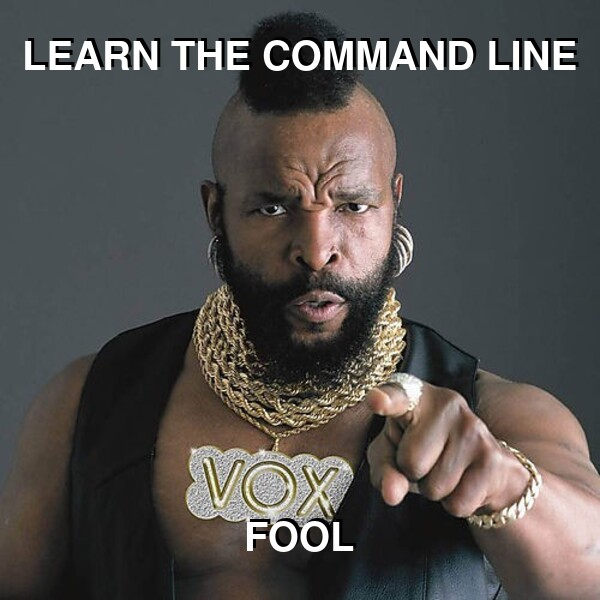

# MEMEGEN

Simple command line meme generator.

## Prerequisites

- POSIX SH(1).
- Imagemagick convert(1).
- nsxiv(1) (Optional)
- mktemp(1)

## Installing

The usual `sudo make install`.

## Ideas for pull requests

- More options for text sizes.
- Better text positioning.
- New images for the store.

## Help

memegen

    Usage: memegen [-i IMAGE] [-t TOP-TEXT] [-b TOP-TEXT] [-o FILE]
    
    Create memes efficiantly from the command line using ImageMagick's
    convert(1).
    
    -i IMAGE-FILE  : Use this image file.
    -i IMAGE-NAME  : Use this image from store.
    -i l[ist]      : List store images.
    -i n[sxiv]     : Select a store image using nsxiv(1).
    
    -t TOP-TEXT    : Put text on the top (can be specified twice).
    -b BOTTOM-TEXT : Put text on the bottom (can be specified twice).
    
    -o FILENAME    : Output filename (by default a temporary file)
    

## Collaborating

For making bug reports, feature requests and donations visit
one of the following links:

1. [gemini://harkadev.com/oss/](gemini://harkadev.com/oss/)
2. [https://harkadev.com/oss/](https://harkadev.com/oss/)
## An example

    memegen -i Mr-T-Pity-The-Fool       \
            -t 'LEARN THE COMMAND LINE' \
            -b 'FOOL!'                  \
            | nsxiv -i

